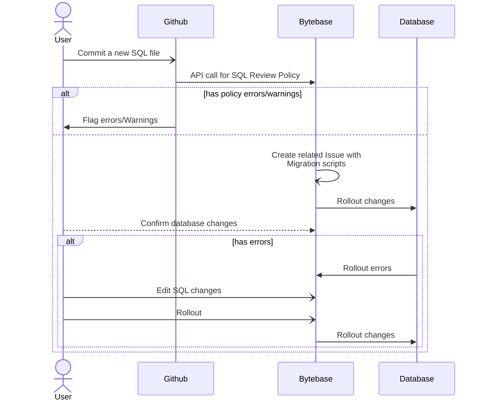

# Bytebase Guide

This document serves as a comprehensive reference for best practices and
standards to be followed by our AI-Lab team. Our goal is to establish
consistency, efficiency, and quality in all aspects of our development
processes.

Please also refer to the [Database Change Management](./adr/006-database-change-management.md)

## Link

Bytebase:
[https://bytebase.inspection.alpha.canada.ca/](https://bytebase.inspection.alpha.canada.ca/)

## User

### First time user

*If we are using the Enterprise version, you should be able to create your own
account and skip these steps*

1. Retrieve your credentials with the DevOps team

2. Log into the tool and clic on your Account/Profil at the top right corner

3. Clic edit then enter your password (Weird UI, we know)


## Project

### New project

- Project Name: The name of the github repo associated with this project db *EG:* ```nachet-datastore```

- Key: Simply your project name *EG:*```Nachet```

## Database

### New DB

In the main page of bytebase there are 2 options:
- `New DB`

New DB will create a Database within your instance. This is not something you should really be doing. However, refer to the [naming convention](008-naming-convention.md) for your database name

- `+Add Instance`

This allows you to create a connection with a database server and import the databases.

## Issues

Issues on bytebase are like github commits for a database. Therefore, keep the naming consise and representative of the changes.

Like stated in the ADR we are using a semantic versioning of schema names to maintain version control. Most changes should come through the Gitops pipeline, however as a dev you might need to test around and do multiple small changes which will create issues.

## Gitops

- SQL Review Workflow:

    The SQL Github workflow is a great tool to apply our established review policies. However, it wont flag fundamental SQL errors within the logic of the statement.

- Gitops migration pipeline

    This features will hook a project to any specified git repo on a specified branch. Once hooked, all new .SQL file committed to that branch will be processed and a migration script will be written and rollout on the database



### Configure GitOps workflow

1. On your Bytebase project configure GitOps; Login with your organization Github and select your desired repository.

2. Specify the branch that should be hooked with this project and the directory in which you will store the .SQL files. EG: `datastore/db/bytebase`

3. Schema change type: DDL

4. File path template: `{{DESCRIPTION}}##{{DB_NAME}}##{{VERSION}}##{{TYPE}}.sql`

5. Enable SQL Review CI. This will automatically create a PR on your Github repo.

6. Note the API token in the generated workflow within your PR.
```yaml
...
steps:
  - name: SQL advise
    run: |
      API="https://THE-KEY-YOU-NEED-TO-NOTE.com"
      TOKEN="${{ secrets.SQL_REVIEW_API_SECRET }}"
      echo "Start request $API"
      ...

```

7. Add the following [ai-lab reusable workflow](https://github.com/ai-cfia/github-workflows/blob/main/.github/workflows/workflow-bytebase-sql-review.yml) instead of the generated one (Documentation  [here](https://github.com/ai-cfia/github-workflows/blob/main/.github/workflows/workflow-bytebase-sql-review.md)):
```yaml

  bytebase-sql-review:
    uses: ai-cfia/github-workflows/.github/workflows/workflow-bytebase-sql-review.yml@main
    secrets: inherit

```

8. Add a `BYTEBASE_API` Secret with the value you noted on the 6th step.

9. Enjoy :)
