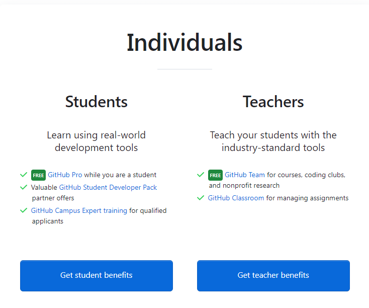
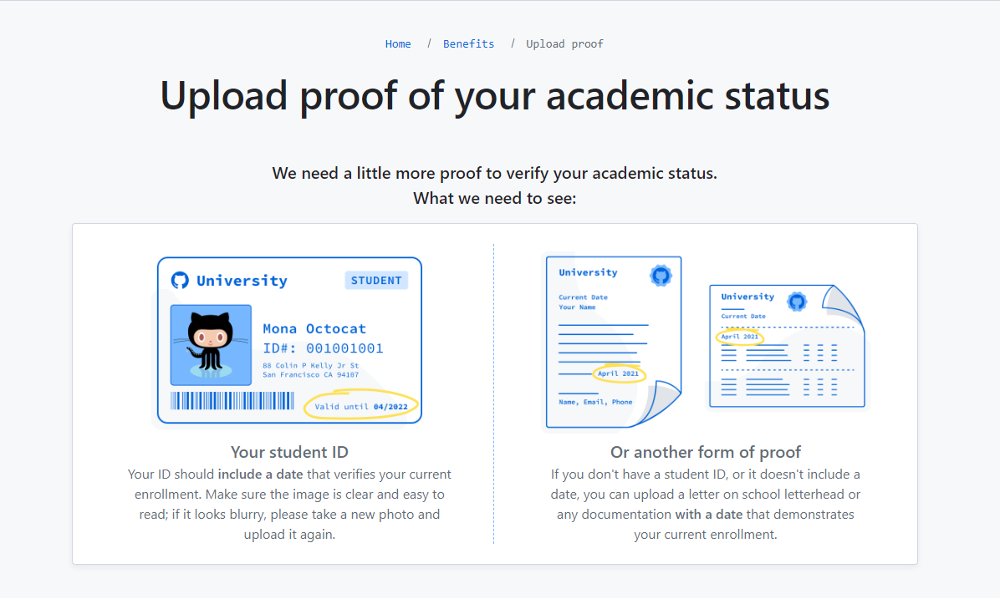
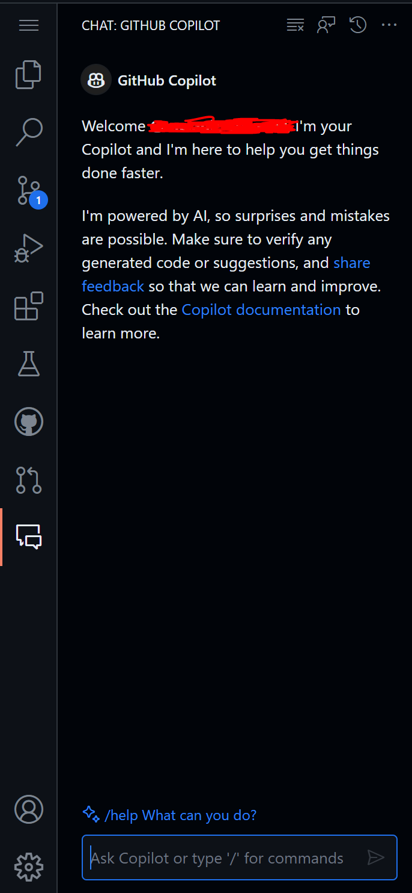

# GitHub Copilot

## Full-time employees - Requesting GitHub Copilot Access

Send an email to <ricky.ng-adam@inspection.gc.ca> to get a license.

## Interns - Requesting GitHub Copilot Access

1. Log in to your GitHub account.

1. Ensure that your university email is linked to your account
   [here](https://github.com/settings/emails). If not, add it and follow the
   steps to verify it.

1. Then, visit the [GitHub Education](https://education.github.com/pack) student
pack page and click on "Sign up for Student Developer Pack" if you don't already
have it. Get student benefits as Individuals.

1. Fill out the request form with the required information. Make sure to use
your student email address and have a valid document or a picture of you student
card to send in the verification section.

1. Submit your request. Once your request is submitted, you will need to wait
   for confirmation from GitHub to access GitHub Copilot. Time may vary, so be
   patient.

---

## Installing GitHub Copilot in VS Code

Once you get the confirmation that your request has been approved, follow these
steps :

1. Open VS Code on your computer or a codespace in GitHub.

1. Go to the "Extensions". Shortcut is `Ctrl+Shift+X`.

1. Search for "GitHub Copilot" in the search bar.

1. Install the extension by clicking the "Install" button.

1. Restart VS Code to activate GitHub Copilot. You may need to log in with your
   GitHub account if not already done. Follow the instructions to set up GitHub
   Copilot.

---

## Using GitHub Copilot

If you start typing code in your file, GitHub Copilot will automatically
generate code suggestions as you type. Use suggestions by pressing `Tab` to
accept them. If a suggestion is not accurate, you can modify it before
accepting.

There is also a chat section that is similar to chatGPT.

## Tips for Effective Use

- **Code Review:** Always check the code generated by GitHub Copilot to ensure
  its accuracy and security.

- **Continuous Learning:** Use GitHub Copilot as a learning tool by examining
  generated suggestions to understand new concepts and best practices.
