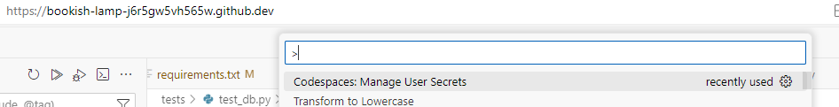

# Github Codespaces

## What is Codespaces

Github Codespaces is a cloud-based development environment that uses a container
to provide you with common languages, tools, and utilities for development. You
can add plugins and extensions within a codespace to personalize your experience
in Visual Studio Code (VSC).

When you want to use a codespace, go on the branch you want to open :


Then, click on code and open a new codespace if it's the first time you open the
branch or open the already existing one if you already worked on it before !


## Why we use Codespaces

### Easier install

Instead of requiring local administrative access and installing software
locally, we open up on the cloud.

### Less security risks

Because no software is installed locally and every code base is containerized by
default, this creates a faster.

### Limitations from local network

Note that firewall at work blocks outgoing port 5432 (Postgresql). A ticket is
opened with security to unblock the port to our sandbox and also provide
instructions to connect through VPN for our dev and prod environment.

For now, the workaround is to connect through GitHub codespaces which is outside
our firewall, so the connection works.

To learn more about codespaces, you can read up on the [Github documentation on
Codespaces](https://github.com/features/codespaces)

## Secrets management

To connect to external services such as the database, you need passwords and API
keys. Typically, locally we'd create an ```.env``` environment but in
Codespaces, you need to use secrets. You can refer to the [Github documentation
on
secrets](https://docs.github.com/en/codespaces/managing-your-codespaces/managing-secrets-for-your-codespaces#adding-a-secret)

This procedure is exactly how to do it, you can read the rest of the page if you
want to know more.

To know which values you are supposed to put inside of these secrets, you need
to go on [Azure portal](https://portal.azure.com/#home) and go to "all
resources" then find "ailabpostgres" and click on it.

You then need to click on connect and follow the connection details.

Another explanation for the secrets in use are available on the [developer page
within the ailab-db
repository](https://github.com/ai-cfia/ailab-db/blob/main/DEVELOPER.md)

Note that you can manage secrets directly from within your Codespaces:


