# List of Visual Studio Code extensions

## ShellCheck

### Extension: timonwong.shellcheck

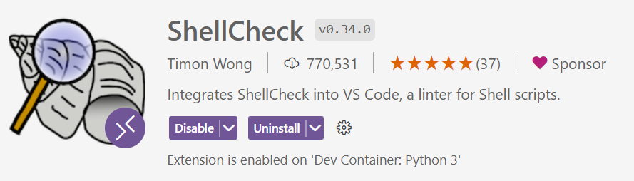

ShellCheck is a tool that gives warnings and suggestions for bash/sh shell
scripts.

### Configuration and usage

Refer to: <https://github.com/koalaman/shellcheck>

## Black Formatter

### Extension: ms-python.black-formatter

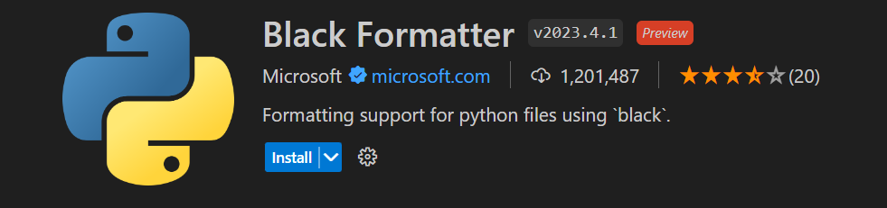

On save (i.e. `Ctrl+S`), it automatically formats your python code to make sure
it adheres to a consistent style. This makes the codebase more uniform and
readable.

### Configuration

Refer to:
<https://marketplace.visualstudio.com/items?itemName=ms-python.black-formatter>

## Extension: ms-python.python

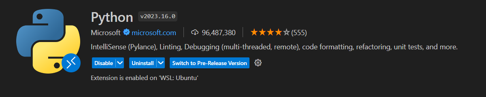

## Extension: ms-vscode-remote.vscode-remote-extensionpack

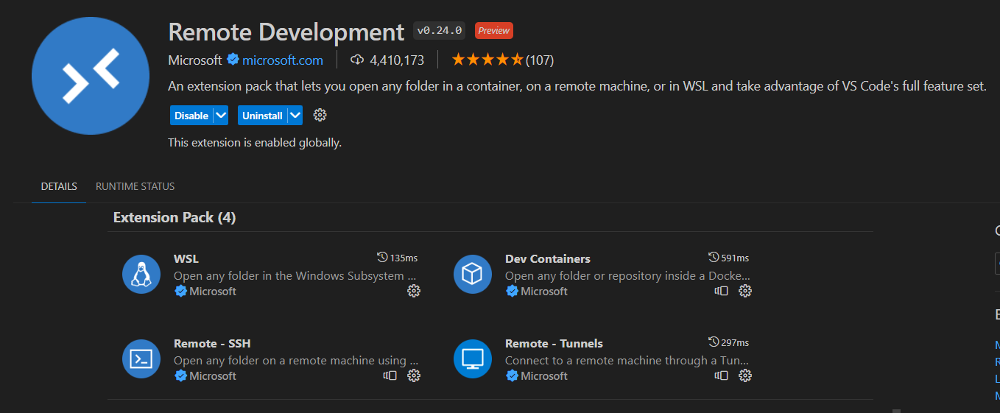

## Configuration and Usage

Refer to [Development Environment
Setup](https://github.com/ai-cfia/dev-rel-docs/blob/main/Development-Environment-Setup-Guide/DEV-ENV-SETUP.md#dev-containers-in-vs-code).

## Extension: GitHub.vscode-pull-request-github

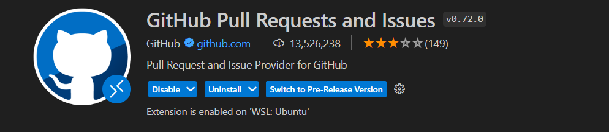

Note:
> Before doing this, make sure to open the command palette (Ctrl + Shift + P)
> and typing `settings` and choose the JSON option. In the setting add
> `"githubIssues.issueBranchTitle":
> "issue-${issueNumber}-${sanitizedLowercaseIssueTitle}"` to your setting. This
> will name the branch according to your issue title.

### Create an issue

Click on the + button in the Issues section.

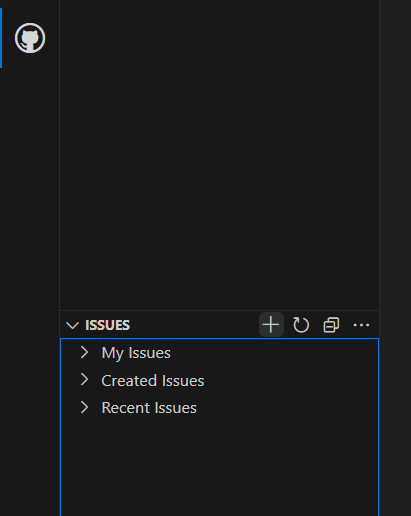

Fill in the information and submit the issue by pressing the checkmark button in
the top right corner.

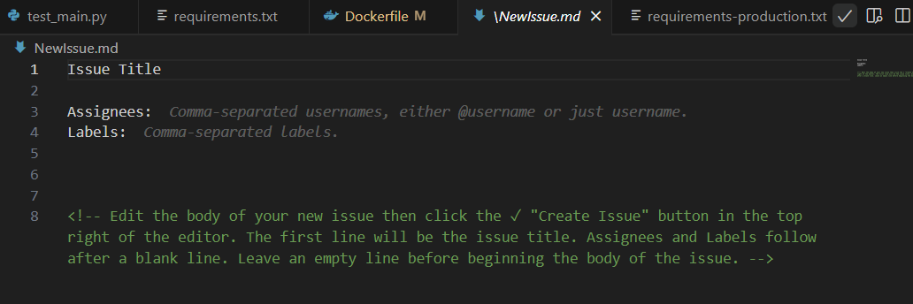

Make sure to follow the [Issue Management
Guidelines](https://github.com/ai-cfia/.github/blob/455ac25f02250a7ea36d77b1737b606338035171/profile/CONTRIBUTING.md).

### Create a Pull Request

Click on the + button in the Pull Requests section.

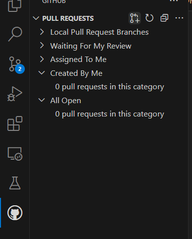

Fill in the information and press `Create`.

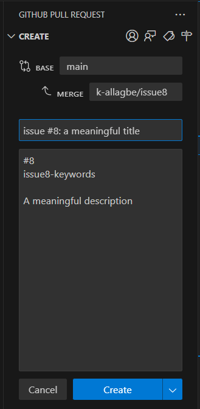

Don't forget to follow the [Issue Management
Guidelines](https://github.com/ai-cfia/.github/blob/455ac25f02250a7ea36d77b1737b606338035171/profile/CONTRIBUTING.md).

## Extension: charliermarsh.ruff

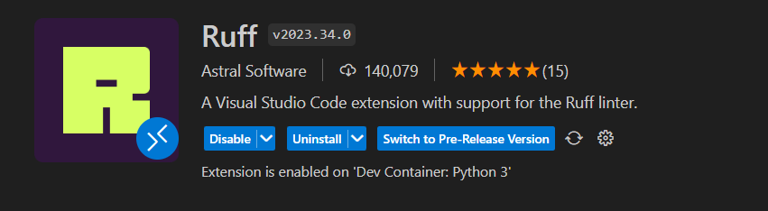

Example

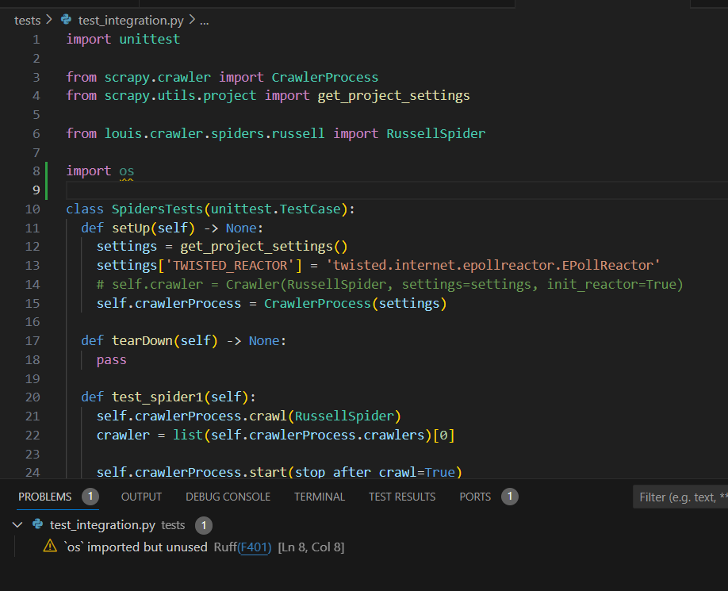
