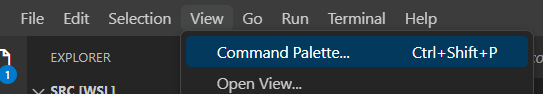

# Troubleshooting Visual Studio Code

## Steps to troubleshoot local config on Visual studio

The reason for using DevContainers is explained here:

Your Open Source Project Needs a devcontainer - Here's Why (aaron-powell.com)

- Consistency: As mentioned above, the biggest benefit of using dev containers
  is that they allow you to consistently reproduce your development environment.
  This means that you can be confident that your code will run the same way on
  any computer, regardless of the underlying operating system or installed
  software.
- Collaboration: Dev containers make it easy for teams to collaborate on
  projects. Instead of each team member needing to set up their own development
  environment, everyone can use the same dev container. This ensures that
  everyone is working in the same environment, which can help to prevent
  conflicts and ensure that everyone is on the same page.
- Portability: Because dev containers are self-contained, they can be easily
  moved from one computer to another. This makes it easy to work on your project
  on multiple computers or to share your development environment with others.
- Isolation: Dev containers provide isolation, which means they won’t interfere
  with any other software or processes running on your computer. This can help
  to prevent conflicts, compatibility issues, or even damage, and it ensures
  that your development environment is clean and stable.

In the terminal, run the following command:
`./install-postgresl-client-15.sh`

Once the downloads are complete, run the following command: `code .`

This will open up new VS code window

Then find Command Palette (or Ctrl+Shift+p)

Then find this is the search bar

Finally confirm this is shown in the bottom left corner of VS code

