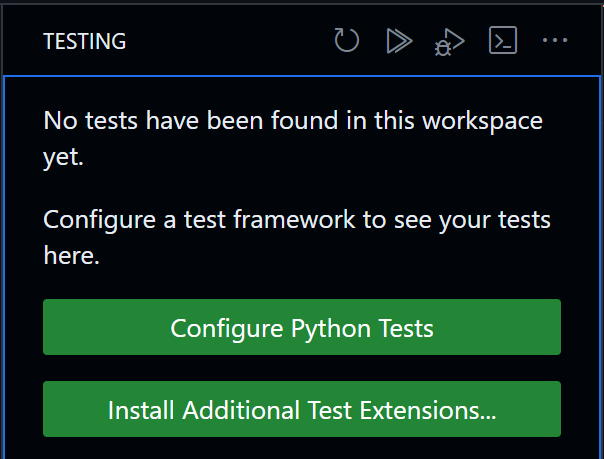

# Writing and Running Unit Tests with Visual Studio Code

## Why Write Unit Tests?

- **Ensure Code Quality:** Unit tests help maintain code quality by verifying
  that each units of code function correctly.

- **Detect Bugs Early:** Writing tests allows to catch and fix bugs early in the
  development process, reducing issues in the future.

- **Facilitate Refactoring:** When changes are made to code, unit tests act as a
  safety net, helping to ensure that existing functionality still works after
  modifications.

## How to Write and Run Unit Tests in Python using VS Code

In the process of creating code, it is a good practice to organize testing by
associating **one test file with a specific functionality**. This approach helps
maintain clarity and ensures that each test file corresponds to a distinct
feature or functionality within the codebase. When dealing with multiple
functionalities contained in a single file, it is advisable to create a
dedicated test file for that specific code file.

Tests are typically focused on small functions, avoiding interactions with
databases or external dependencies. This allows for efficient and isolated
testing of individual units, ensuring that each function performs as expected in
isolation. The test file is intricately linked to the corresponding code file,
forming a cohesive unit where changes or updates in the code are reflected and
validated through the associated tests. This practice contributes to a
systematic and organized testing strategy, facilitating the identification and
resolution of issues specific to each functionality.

To get started on testing your project in Visual Studio Code, click on the
following icon on the left:

Then, click on "Configure Python Tests", select unittest and the test folder of
your project. It is usually named "tests".

If your tests require to connect to a database or an api, you should include the
`SetUp(self)` and `TearDown(self)` functions as they will be called before and
after each test.
