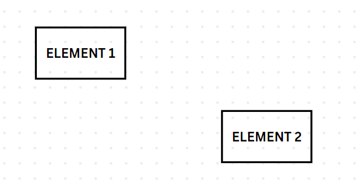

# Canva

## Considerations

Each diagram should display the following information:

* Title
* Date of creation
* Agency
  [Logo](https://merlin.cfia-acia.inspection.gc.ca/a-propos-de-nous/compendium/politiques-et-directives-en-communication/pcim-de-l-acia/fra/1490906680552/1490906680553)
* Author's agency email: <name.surname@inspection.gc.ca>
* AI Lab email: <cfia.ai-ia.acia@inspection.gc.ca>

To prevent having to look for diagrams in the case where we would need to edit
one, use [this Canva
Whiteboard](https://www.canva.com/design/DAFzCw9SgCY/dhjzUTbgNl29QOJIqOXEOA/edit?ui=eyJHIjp7fX0)
and add your new diagram as a new page.

---

### Step 1: Duplicate Diagram Template

* Right-click the template and duplicate it

### Step 2: Create your Diagram

Whiteboards have no size limit, take space you need. When you export your
diagram, it will crop automatically. **Ensure your new diagram follows this same
layout.**

### Step 3: Export your Diagram

* File → Download

---

### Tips

#### Creating an empty shape

* Select "Elements" from the side menu

* Select "See all" in the Shapes category
* Select the shape you need
* On the canvas, select the shape that was added
* Click on "Color"

* Select "No color"

* Click on "Border style"

* Apply desired border style
* Change color as desired

* Double-click in the shape to add text directly

#### Adding curved arrows between elements

* Select "Elements" from the side menu
* From the Shapes category, select the arrow shape you need
* Connect the arrow to the elements

* Select the arrow
* Select "Line type"

* Select "Elbowed"

* You can also change the color, the style, and the line start/end
