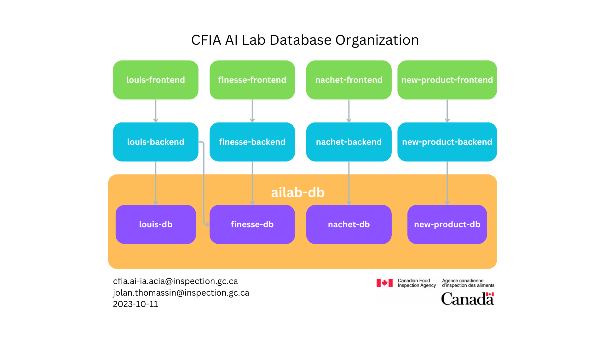

# Creating Diagrams

## Considerations

Each diagram should display the following information:

* A title for the diagram
* Date of creation
* Agency Logo
* AI Lab personal email: <name.surname@inspection.gc.ca>
* AI Lab email: <cfia.ai-ia.acia@inspection.gc.ca>

The information should be at the bottom of the diagram, and should not be too
big to not overwhelm the data. Put the title at the top.

_Example :_ 
