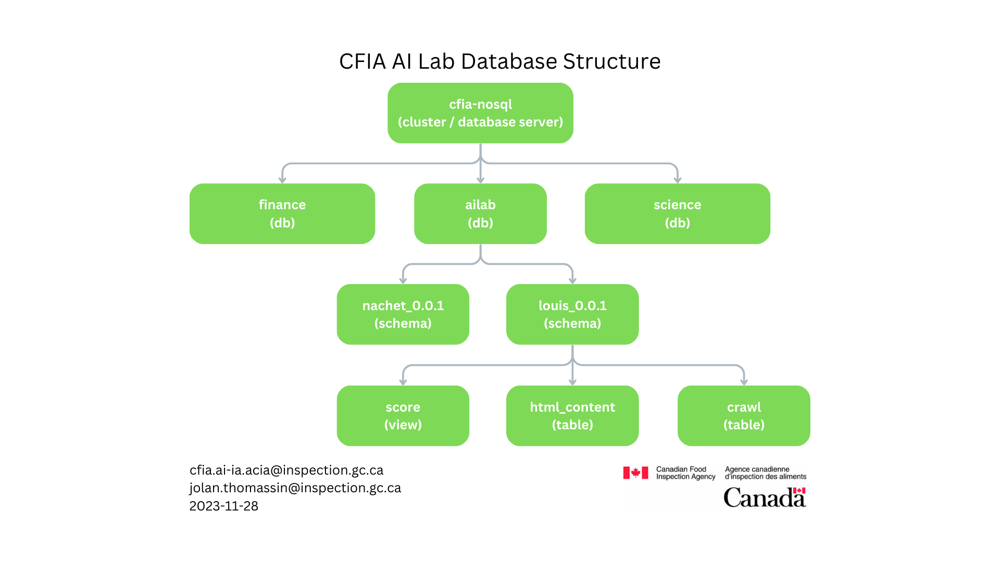

# ADR on our choices of database structure

This ADR details our decisions regarding the database structure and highlights the factors influencing our choices.

## Top-level
- **Title:** ADR on our choices of database structure
- **Status:** Proposed
- **Evaluation Criteria:** We want to figure out the best way to set up the database so that many products can work together smoothly. This will make things flexible, easy to take care of, and help different teams work together better.
- **Candidates to Consider:** We looked at different ways to set up the database for lots of products, like keeping them separate or changing how they're organized.

## Research and Analysis of Each Candidate
In our investigation, we looked very closely at how "louis-db" and "nachet-db" are set up right now, and we also checked out the idea to change things. We found that having separate databases like drawers made it hard to change and work together. But if we put everything in one big "wardrobe," it would be much better. This change would make it easier to take care of, prevent mistakes, and help us with all the different products we have. So, we think switching to the big "wardrobe" is the best way to go for our database.

- **Does/Doesn't Meet Criteria and Why:**
The way we have separate databases right now isn't good because it causes repetition, is not flexible, and makes it hard for us to work together. But the changes we want to make are better because they make things work together, are easier to manage, and make the computer code better.

## How Did You Evaluate the Candidates?
We evaluated the candidates based on the criteria of efficiency, flexibility, maintainability, and collaborative potential. The proposed changes best align with these criteria.

## Why Did You Choose the Winner?
We picked the changes we suggested because they fit with our goal of making one simple database that can easily work with lots of different products.

## What Is Happening Since Then?
The proposed changes are under consideration for implementation, with a focus on developing the "ailab-db" as the core database and creating a modular product integration system.

## Knowing What You Know Now, What Would You Advise People to Do Differently?
We think it's a good idea for others to think about how changing their database now can help them in the future when they have more products and need to grow. Sometimes, making some changes and spending some money at the beginning can be really helpful later on.

- **Recommendation:**
We suggest making the changes we talked about, like calling "louis-db" by a new name, "ailab-db," and arranging things in a better way. These changes match our goal and are super important for handling lots of products, making things easier to use, taking care of the computer code, and helping teams work together better.
